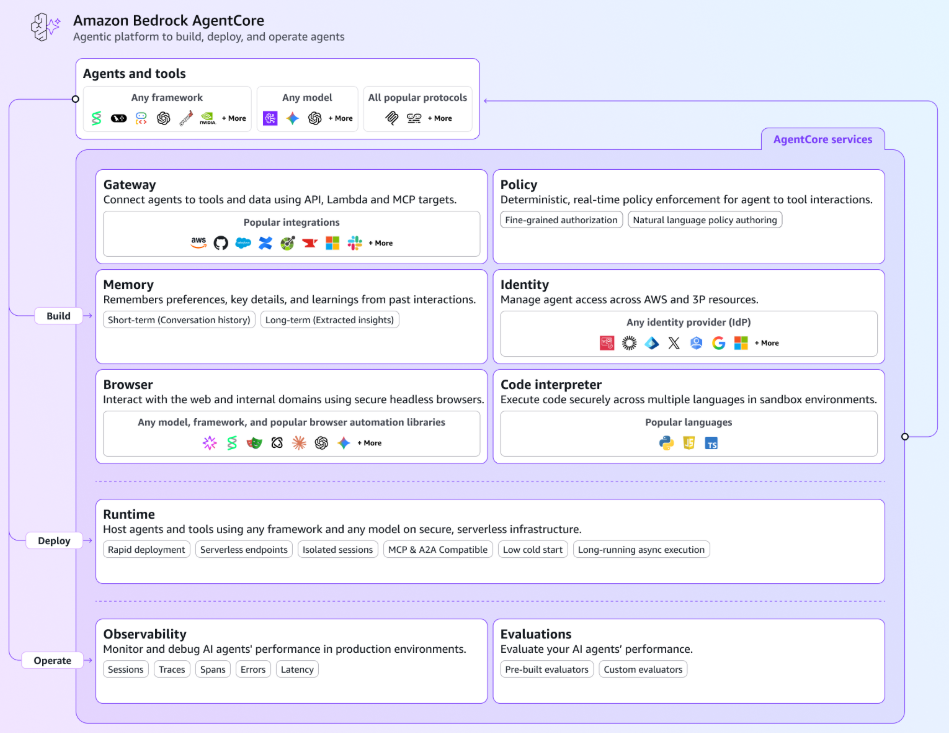
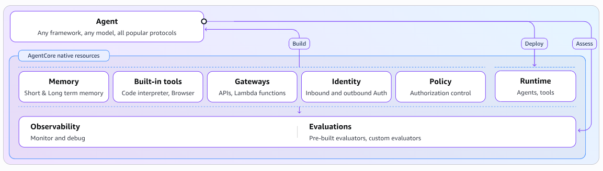
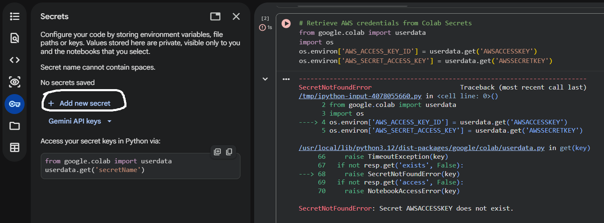
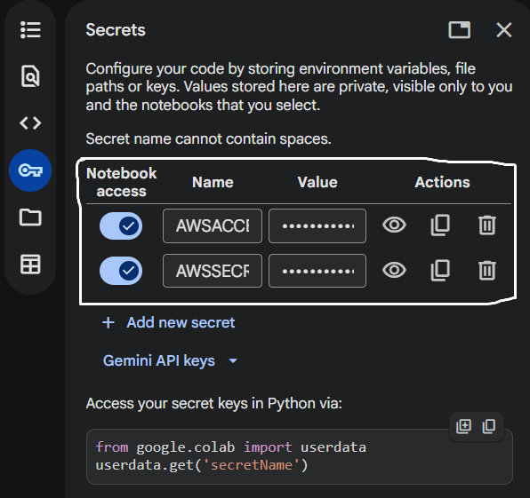

## 📘 Overview

[Amazon Bedrock AgentCore](https://aws.amazon.com/bedrock/agentcore) is a agentic platform for building, deploying, and operating agents using any framework and any foundation model.

| AgentCore Service | Description |
| :--- | :--- |
| AgentCore Runtime | Serverless agent and tools such as MCP and A2A deployment. |
| AgentCore Gateway | Connect agent to services such as Lambda function and API that converted to MCP compatible. |
| AgentCore Identity | Identity and access management for agent and tool. |
| AgentCore Memory | Store context across interaction both short-term and long-term. |
| AgentCore Browser | Browser runtime that interact with web app. |
| AgentCore Code Interpreter | Execute code across multiple languages such as Python. |
| AgentCore Observability | Monitoring agent and tools in Amazon CloudWatch. |
| AgentCore Evaluation | Improve agent quality and performance. |
| AgentCore Policy | Control agent and tool interaction. |

## 📁 Repository Structure

| Folder | Description |
| :--- | :--- |
| [runtime](./runtime) | Folder of AI agent implementation using **AgentCore Runtime** and **AgentCore Observability**. |
| [mcp-server](./mcp-server) | Folder of MCP server implementation using **AgentCore Runtime** and **AgentCore Gateway**. |
| [identity-memory](./identity-memory) | Folder of implementation using **AgentCore Identity** and **AgentCore Memory**. |

## 🚀 Getting Started - first time only

**Step 1 - AWS**

1. Sign in/login AWS account, click AWS username top right corner, click Security credentials.
2. In My security credentials page, see Access keys then click Create access key.
3. Checklist understand then click Create access key.
4. Copy AWS access key and AWS secret key to notepad.

**Step 2 - Google Colab**

1. Open notebook in Google Colab then click Add new secret to add AWS credentials (AWS secret key and AWS access key) to Colab Secret.
2. Write AWS access key variable name such as AWSACCESSKEY and paste AWS access key to value.
3. Write AWS secret key variable name such as AWSSECRETKEY and paste AWS secret key to value.
4. Enable AWS access key and AWS secret key to notebook access to access AWS services you needed.
5. Run cell/code about retrieve AWS credentials again and this is worked.

Before using Colab Secret : 

Using Colab Secret : 

## ⚠️ Warning

**Ensure securely API keys such as AWS credentials — DO NOT HARDCORE them in notebooks.**

## 📚 Resources

[Amazon Bedrock AgentCore documentation](https://docs.aws.amazon.com/bedrock-agentcore/)

## 🙏 Acknowledgments

**Amazon Web Services (AWS) and Google Colab**